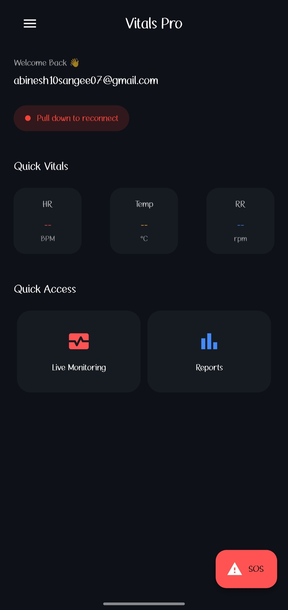
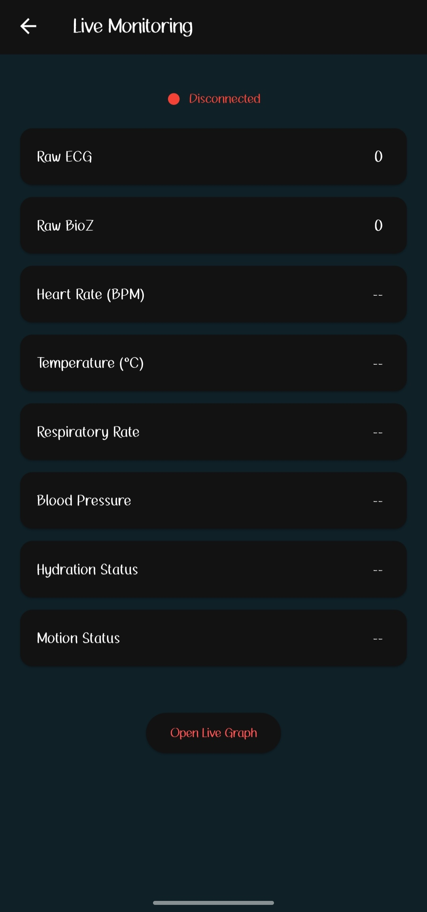
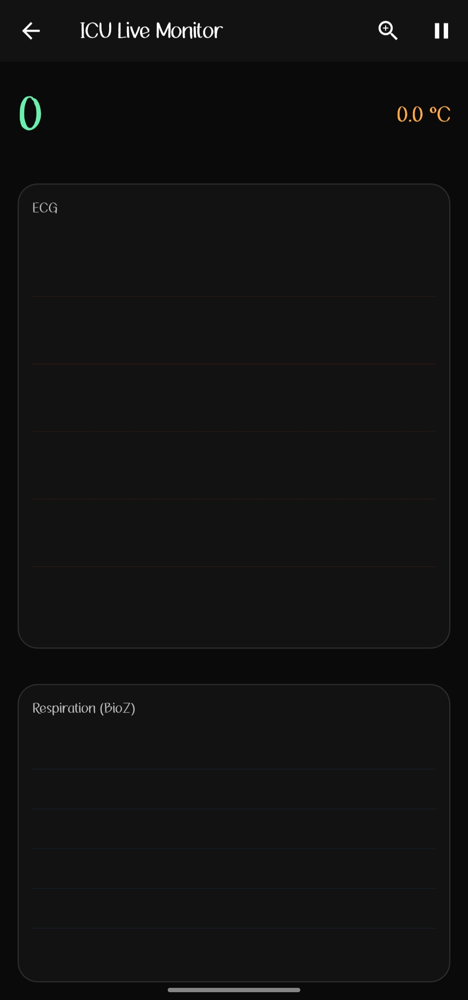

🚑 Vitals Pro — Intelligent Health Monitoring System
Vitals Pro is a next-generation AI-powered health monitoring application that integrates wearable sensors, a mobile app, and intelligent backend systems to provide real-time health monitoring and predictive insights.

🧠 System Overview
Vitals Pro follows a multi-layer architecture:

📱 Mobile Application (Flutter) — User interface & visualization
🤖 AI Backend (Flask) — Health prediction & analytics (integration ready)
🔌 Hardware Layer (ESP32 + Sensors) — Real-time data acquisition (in progress)

This repository contains the Flutter Mobile Application.

🚀 Key Features

📊 Real-time health monitoring dashboard
❤️ Heart Rate (HR) monitoring
🌡 Body Temperature tracking
🫁 Respiratory Rate (RR) monitoring
🧠 AI-based health score & prediction (planned)
🔗 BLE connection with ESP32 (in progress)
🔐 Firebase Authentication (Login/Signup)
📈 Live ECG & BioZ visualization
🚨 Emergency SOS feature

🛠 Technology Stack

Layer
Technology

Frontend
Flutter

Backend
Flask (Python)

Hardware
ESP32 + Sensors

Auth/DB
Firebase

## 📱 Application Preview

### 🏠 Home Dashboard

### 📡 Live Monitoring

### 🏥 ICU Live Monitor

🏗 Project Structure
Vitals-Pro-App/
│
├── lib/                # Main Flutter source code
├── assets/             # Images & animations
├── screenshots/        # App preview images
├── android/            # Android configuration
├── ios/                # iOS configuration
├── pubspec.yaml        # Dependencies

⚙️ Setup & Installation
1️⃣ Clone the repository
git clone https://github.com/yourusername/Vitals-Pro-App.git

2️⃣ Navigate to project directory
cd Vitals-Pro-App

3️⃣ Install dependencies
flutter pub get

4️⃣ Run the application
flutter run

🔗 System Repositories

📱 Mobile App (This Repo)
🤖 AI Backend (Coming Soon)
🔌 Hardware System (Coming Soon)

🎯 Future Enhancements

☁️ Cloud-based real-time sync
🏥 Doctor/Guardian dashboard
📊 Advanced AI diagnostics
⌚ Wearable optimization
🔔 Smart alerts & notifications

👨‍💻 Author
Abinesh Kumar
Electronics and Communication Engineering
Passionate about AI, Embedded Systems & Health Tech

⭐ Support
If you find this project useful, give it a ⭐ on GitHub!

